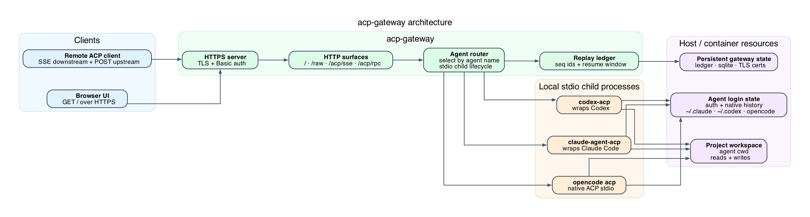

# acp-gateway

Expose local ACP coding agents over a private network with an authenticated web
UI and an SSE/POST transport.

`acp-gateway` runs one or more ACP agents as local stdio child processes, then
serves them through a browser UI or a remote ACP client. It does not host agents
somewhere else: the agent binary, project checkout, and agent login state must be
available on the same host or inside the same container as the gateway.



## Features

- Browser chat UI at `/`, protected by HTTP Basic auth.
- SSE downstream + POST upstream ACP transport for remote clients.
- Multiple named agents via `agents.json`, with runtime agent switching.
- Per-agent replay ledger for mobile disconnect/reconnect handling.
- Built-in TLS by default, with self-signed cert generation or bring-your-own certs.
- History browsing for supported agents: Claude Code, Codex, and opencode.

## Requirements

- Node.js 22 LTS and npm.
- `openssl` if using the default generated self-signed TLS certificate.
- At least one ACP agent available on the gateway host:
  - Claude: `claude` installed and logged in.
  - Codex: `OPENAI_API_KEY` / `CODEX_API_KEY`, or `codex login`.
  - opencode: `opencode` installed and authenticated separately.

## Quick Start

```sh
npm install
cp env.example .env
cp agents.example.json agents.json
```

Edit `.env` and set the required gateway account:

```sh
ACPG_AUTH_USER=acp
ACPG_AUTH_TOKEN=change-me-to-a-long-random-secret
```

Edit `agents.json` so each agent's `cwd` points at a real project directory:

```json
{
  "claude": {
    "cmd": "node_modules/.bin/claude-agent-acp",
    "args": [],
    "cwd": "/path/to/project"
  },
  "codex": {
    "cmd": "node_modules/.bin/codex-acp",
    "args": [],
    "cwd": "/path/to/project"
  }
}
```

Start the gateway:

```sh
./start.sh
```

Open the web UI:

```text
https://localhost:8080/
```

The default TLS certificate is self-signed, so your browser or client will ask
you to trust it. For local browser testing without TLS setup:

```sh
make dev DEV_AUTH=1
```

That starts an isolated dev gateway on port `8791` over HTTP with temporary
`dev` / `dev` credentials and prints a colored warning banner.

## Configuration

The gateway reads environment variables from the shell and from `.env`.
`env.example` is the source of truth for available settings.

Required:

| Variable | Purpose |
|---|---|
| `ACPG_AUTH_USER` | Username for HTTP Basic auth and remote ACP clients. |
| `ACPG_AUTH_TOKEN` | Password/token for HTTP Basic auth and remote ACP clients. |

Common optional settings:

| Variable | Default | Purpose |
|---|---:|---|
| `ACPG_LISTEN` | `0.0.0.0:8080` | Gateway listen address. |
| `ACPG_LEDGER_DIR` | `/data` | Ledger, SQLite state, and generated TLS material. Use persistent storage. |
| `ACPG_AGENTS_FILE` | `./agents.json` | Agent definitions. |
| `ACPG_DEFAULT_AGENT` | first agent | Agent selected when a client does not specify one. |
| `ACPG_TLS` | `on` | Set `off` only behind trusted local/dev transport or a TLS-terminating proxy. |
| `ACPG_TLS_CERT` / `ACPG_TLS_KEY` | auto | PEM cert/key paths for bring-your-own TLS. |
| `ACPG_FS_ROOT` | user home | Directory root the web UI may browse for folders and `@` file references. |
| `CODEX_HOME` | `~/.codex` | Codex login/session state. |
| `CLAUDE_CONFIG_DIR` | `~/.claude` | Claude login/session state and history. |

## Agents

`agents.json` maps agent names to commands:

```json
{
  "claude": { "cmd": "node_modules/.bin/claude-agent-acp", "args": [], "cwd": "/workspace" },
  "codex": { "cmd": "node_modules/.bin/codex-acp", "args": [], "cwd": "/workspace" },
  "opencode": { "cmd": "/usr/local/bin/opencode", "args": ["acp"], "cwd": "/workspace" }
}
```

Relative `cmd` values resolve from the gateway install directory. `cwd` is the
project directory the agent works in. If `cwd` is omitted, `ACPG_AGENT_CWD` is
used, then the gateway user's home directory.

The gateway skips agent entries whose command does not exist, so one shared
`agents.json` can include optional agents. It exits if no usable agents remain.

## Deployment

Choose the deployment model based on where the agent login state lives:

| Use case | Recommended path |
|---|---|
| Quick host or VM test | `make deploy` or run `./start.sh` under your own supervisor. |
| Linux service reusing host login state | systemd example in [`deploy/`](deploy/). |
| macOS service reusing local Claude login | `make deploy-mac` or the launchd example in [`deploy/`](deploy/). |
| Containerized deployment | Docker/Compose examples in [`deploy/`](deploy/), with agent login state mounted in. |

Deployment artifacts and notes live in [deploy/README.md](deploy/README.md).

## Remote ACP Clients

Remote clients use SSE for agent-to-client frames and POST for client-to-agent
frames:

```text
GET  https://<host>:8080/acp/sse?user=<user>&token=<token>&agent=claude
POST https://<host>:8080/acp/rpc?user=<user>&token=<token>&agent=claude&conn=<conn>
```

The SSE stream first emits `ready` with a `conn` id. POST requests use that id to
route frames back to the right stream. Clients can resume by sending the last SSE
`id` as `Last-Event-ID` or `?lastEventId=<n>`.

## Security

- All HTTP surfaces except `GET /healthz` require the shared gateway account.
- TLS is on by default. Without configured certs, the gateway generates and
  reuses a self-signed cert under `ACPG_TLS_DIR`.
- `GET /healthz` is intentionally unauthenticated and returns only status plus
  agent names. It does not expose `cwd`, history support, or resume details.
- Auth is a single shared account. There is no per-user identity or permission
  model in the gateway.

## Development

```sh
npm run build
npm run typecheck
npm test
npm --prefix web test
```

Useful local targets:

```sh
make dev             # isolated dev gateway, HTTP by default
make dev DEV_AUTH=1  # fixed dev/dev credentials for browser testing
make dev-watch       # live reload
make help            # all make targets
```

## Documentation

- [env.example](env.example): complete environment variable reference.
- [agents.example.json](agents.example.json): starter multi-agent config.
- [deploy/README.md](deploy/README.md): Docker, systemd, and launchd deployment examples.

## License

See [LICENSE](LICENSE).
