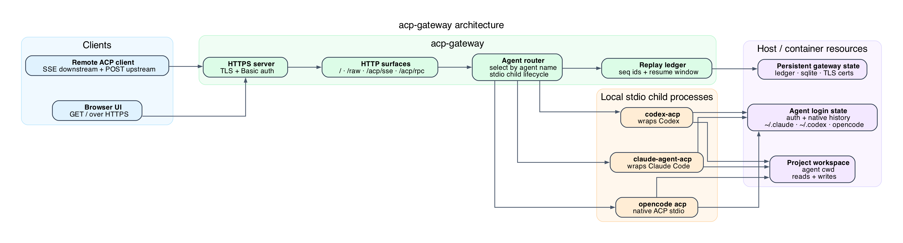

# acp-gateway

Expose local ACP coding agents over a private network with an authenticated web
UI and an SSE/POST transport.

`acp-gateway` runs one or more ACP agents as local stdio child processes, then
serves them through a browser UI or a remote ACP client. It does not host agents
somewhere else: the agent binary, project checkout, and agent login state must be
available on the same host or inside the same container as the gateway.



## Features

- Browser chat UI at `/`, protected by HTTP Basic auth.
- SSE downstream + POST upstream ACP transport for remote clients.
- Multiple named agents via `agents.json`, with runtime agent switching.
- File preview side panel: the agent's plan, every file the work touched (tool
  calls merged with `git status` and with the folders it wrote into outside the
  checkout, so shell-generated files aren't invisible), what it only read,
  per-file diffs, image previews, and live HTML previews with their assets
  inlined.
- Branch a conversation: type the message you want to ask somewhere else, hit
  `branch` instead of `send`, and it opens in a fork of the thread (the whole
  history, copied agent-side via ACP `session/fork`) inside a floating window
  over its parent — with its own composer, so two lines of attack run side by
  side. Branching always carries a message, which is what gives the fork a
  transcript and a place in the sidebar. Offered only for agents that advertise
  `sessionCapabilities.fork` (Claude today).
- Open a conversation as a side chat: right-click (or long-press) any sidebar row
  and pick `Open as side chat` to resume that conversation live in the same
  floating window, beside the one that stays in the main column. The folder on
  screen and the conversation in it are both left alone. Offered for rows under
  the agent that's connected, since another agent's row would need a reconnect.
- Per-agent replay ledger for mobile disconnect/reconnect handling.
- Built-in TLS by default, with self-signed cert generation or bring-your-own certs.
- History browsing for supported agents: Claude Code, Codex, and opencode.

## Requirements

- Node.js 24+ and npm. Server-side state uses Node's built-in `node:sqlite`
  (unflagged on Node 24). Node 24+ runs on `main`. To run on Node 22 instead,
  use the `legacy/node22` branch, which keeps the `better-sqlite3` native addon.
- `openssl` if using the default generated self-signed TLS certificate.
- At least one ACP agent available on the gateway host:
  - Claude: `claude` installed and logged in.
  - Codex: `OPENAI_API_KEY` / `CODEX_API_KEY`, or `codex login`.
  - opencode: `opencode` installed and authenticated separately.

## Quick Start

```sh
npm install
cp env.example .env
cp agents.example.json agents.json
```

Edit `.env` and set the required gateway account:

```sh
ACPG_AUTH_USER=acp
ACPG_AUTH_TOKEN=change-me-to-a-long-random-secret
```

Edit `agents.json` so each agent's `cwd` points at a real project directory:

```json
{
  "claude": {
    "cmd": "node_modules/.bin/claude-agent-acp",
    "args": [],
    "cwd": "/path/to/project"
  },
  "codex": {
    "cmd": "node_modules/.bin/codex-acp",
    "args": [],
    "cwd": "/path/to/project"
  }
}
```

Start the gateway:

```sh
./start.sh
```

Open the web UI:

```text
https://localhost:8080/
```

The default TLS certificate is self-signed, so your browser or client will ask
you to trust it. For local browser testing without TLS setup:

```sh
make dev DEV_AUTH=1
```

That starts an isolated dev gateway on port `8791` over HTTP with temporary
`dev` / `dev` credentials and prints a colored warning banner.

## Configuration

The gateway reads environment variables from the shell and from `.env`.
`env.example` is the source of truth for available settings.

Required:

| Variable | Purpose |
|---|---|
| `ACPG_AUTH_USER` | Username for HTTP Basic auth and remote ACP clients. |
| `ACPG_AUTH_TOKEN` | Password/token for HTTP Basic auth and remote ACP clients. |

Common optional settings:

| Variable | Default | Purpose |
|---|---:|---|
| `ACPG_LISTEN` | `0.0.0.0:8080` | Gateway listen address. |
| `ACPG_LEDGER_DIR` | `/data` | Ledger, SQLite state, and generated TLS material. Use persistent storage. |
| `ACPG_AGENTS_FILE` | `./agents.json` | Agent definitions. |
| `ACPG_DEFAULT_AGENT` | first agent | Agent selected when a client does not specify one. |
| `ACPG_TLS` | `on` | Set `off` only behind trusted local/dev transport or a TLS-terminating proxy. |
| `ACPG_TLS_CERT` / `ACPG_TLS_KEY` | auto | PEM cert/key paths for bring-your-own TLS. |
| `ACPG_FS_ROOT` | user home | Directory root the web UI may browse for folders and `@` file references. |
| `ACPG_PREVIEW_ROOTS` | _(none)_ | Extra directories the file preview panel may read, colon-separated (e.g. `/tmp`). By default it sees only the conversation's own project — see [What the preview can reach](#what-the-preview-can-reach). |
| `ACPG_PREVIEW_FILTER_ENABLED` | `1` | Set `0` to let the preview panel read **any** file on the host, ignoring the rules above. Convenient on a machine you own; makes the gateway credential a read-any-file capability. |
| `ACPG_HISTORY_HEADLESS` | `off` | Set `on` to list headless runs — `claude -p` and `codex exec` — alongside real conversations. Off by default: a scripted or cron-driven run writes one transcript per invocation, usually in a throwaway cwd, so a nightly job buries your own sessions under its folders. The interactive CLIs and SDK/ACP sessions (including the gateway's own) are always listed. |
| `CODEX_HOME` | `~/.codex` | Codex login/session state. |
| `CLAUDE_CONFIG_DIR` | `~/.claude` | Claude login/session state and history. |

## Agents

`agents.json` maps agent names to commands:

```json
{
  "claude": { "cmd": "node_modules/.bin/claude-agent-acp", "args": [], "cwd": "/workspace" },
  "codex": { "cmd": "node_modules/.bin/codex-acp", "args": [], "cwd": "/workspace" },
  "opencode": { "cmd": "/usr/local/bin/opencode", "args": ["acp"], "cwd": "/workspace" }
}
```

Relative `cmd` values resolve from the gateway install directory. `cwd` is the
project directory the agent works in. If `cwd` is omitted, `ACPG_AGENT_CWD` is
used, then the gateway user's home directory.

The gateway skips agent entries whose command does not exist, so one shared
`agents.json` can include optional agents. It exits if no usable agents remain.

### Default model and thinking level

An agent's model and thinking level otherwise come from its CLI's own global
config — `~/.claude/settings.json` for `claude-agent-acp` — which is the same file
that CLI's `/model` picker writes when you use it in a terminal. `defaults` gives
the gateway a starting point of its own that a terminal `/model` cannot move:

```json
{
  "claude": {
    "cmd": "node_modules/.bin/claude-agent-acp",
    "cwd": "/workspace",
    "defaults": { "model": "opus[1m]", "effort": "xhigh" }
  }
}
```

Keys are the agent's own config option ids (`model`, `effort`, `mode` for
claude-agent-acp; `model`, `reasoning_effort`, `approval_policy` for codex-acp),
values its option values — aliases the agent resolves itself, like `opus`, work
too. Anything the session doesn't offer is dropped rather than pushed.

These apply to sessions the gateway *creates*. A resumed conversation instead
comes back to whatever it was last running: the gateway records each session's
controls (`session_controls` in `state.sqlite`) and puts them back after a
`session/load` rebuilds it at its defaults, so changing `defaults` — or the CLI's
global config — never rewrites the model an existing conversation ran on.

## File Preview

An agent working through the gateway writes real files on the gateway host —
edited modules, generated reports, screenshots. The **Files** button in the top
bar opens a side panel for reading them back. It has two modes:

**Session** — what this conversation did, as one scrolling column of collapsible
sections. The default.

| Section | What it shows |
|---|---|
| Progress | The agent's current plan, when it has published one. |
| Outputs | Every file this turn's work touched, from three sources merged into one list: what the conversation wrote (its own tool calls), what `git status` reports dirty in the checkout, and — for work no tool call named and no checkout contains — everything in the folders the conversation wrote into outside the repo. One row per file, grouped by how strong the claim is, because only the first group means "this conversation produced it". A file git tracks leads with git's status letter (`A`/`M`/`D`/`R`/`U`) and its `+`/`−` line counts; anything git has nothing to say about — a file written to `/tmp`, written and reverted, or already committed — leads with its type icon instead. |
| Context | Files the conversation only consulted — read, searched, fetched. |

**Project** — the folder itself, as a lazily-expanded tree with a pinned **Find
files** box that matches on any part of a path. Every list in Session is built
*from* the conversation, so none of them knows about a file nobody has touched
yet; this is how you open one. Entries `git` ignores are dimmed rather than
hidden, and `.git` is the one thing left out.

Two modes rather than a fourth section, because the tree wants the panel's full
height and answers a question you know you are asking. Within Session the three
lists stay stacked and simultaneously visible — splitting *those* into tabs is
what makes a reader guess which list knows about a given file.

Opening a row shows that file:

| View | What it shows |
|---|---|
| Diff | A file's unified diff against `HEAD`, staged and unstaged work together. A new file diffs as entirely added. |
| File | The file itself: text, or an inline image, or a download for anything binary. |
| Preview | Markdown rendered, or an `.html` shown live in a sandboxed frame with its own images, fonts and stylesheets inlined — see below. Download there saves that self-contained copy, not the bare file. |

In the conversation, a file the agent wrote appears as a card — its type and a
download button — instead of a line of monospace; a file it only read stays a
plain path. Both open the panel on that file.

On a wide screen the panel is a column you can drag wider or narrower by its
left edge; the width is remembered per device. Below 1100px it is a sheet.

### What the preview can reach

By default the panel reads **the conversation's own project and nothing else**:

1. anything under the conversation's folder (its `cwd`);
2. anything under the git repository that folder sits in — because Outputs
   includes the whole checkout's `git status`, a conversation opened on a
   subdirectory would otherwise show repo-wide rows it then refused to open;
3. anything under a directory you name in **`ACPG_PREVIEW_ROOTS`**.

The `cwd` itself is still checked against `ACPG_FS_ROOT`, so a client cannot
widen its own reach by asking for `cwd=/`.

Rule 3 is the escape hatch, and it is opt-in on purpose. An agent's output does
not always land in the checkout — "write the screenshot to `/tmp`" is an
ordinary instruction — and a viewer that then refuses to show the file is
reporting its own configuration rather than the work. Making that an explicit
list keeps the panel's reach something a deployment states out loud instead of
turning the gateway credential into a read-any-file capability:

```sh
ACPG_PREVIEW_ROOTS=/tmp:/var/exports   # colon-separated, PATH-style
```

If naming roots is bookkeeping you don't want — a single-user gateway on a
machine you already own, where the agent writes wherever it likes — turn the
filter off entirely:

```sh
ACPG_PREVIEW_FILTER_ENABLED=0   # default 1; `off` and `false` work too
```

Then rules 1–3 stop applying and `ACPG_PREVIEW_ROOTS` no longer matters: the
panel reads any file the gateway process can. Say it plainly — with this set,
whoever holds the gateway credential can read any file on that host. It is
off-by-choice, never by default.

What the toggle does **not** change: `cwd` is still checked against
`ACPG_FS_ROOT`, because that bound is about which folders a conversation may
claim to run in, not which files a preview may open.

Everything else about the surface: Basic auth on every route, read-only (nothing
here writes, stages, or reverts), `/workspace/raw` serving common raster image
types with their real content type and **everything else** as an opaque
`attachment` with `nosniff` and a deny-everything CSP — so a generated `.html`
or `.svg` can never run as script in the console's origin — plus a 25 MB cap per
raw response and caps on diff and text size.

The sources are merged because none subsumes the others, and having to know which
one knew about a given file was the panel's own bookkeeping leaking into the UI.
Tool calls see files that git cannot — written and reverted, already committed, or
outside any checkout. `git status` sees files no tool call names: **anything an
agent writes through a shell** (`Bash`, and every codex or opencode edit) reports
a command, never a path.

Those two still miss the same file whenever a shell writes *outside* the
checkout, which is what "generate the mockup in `/tmp`" does every time — the
tool call names nothing and git has never heard of the folder. So the third
source lists such a folder whole. Which folders qualify is decided on the
gateway, and deliberately narrowly: the parent of a file this conversation
actually wrote, outside the checkout (inside it, `git status` is the authority),
one level deep, and never a folder everything on the host lives in — `/tmp`
itself is a boundary, not an output folder, or one `Write /tmp/report.html` would
turn Outputs into a listing of your temp directory. There is no mtime cutoff and
no parsing of shell commands for path-looking strings: a cutoff means nothing for
a conversation replayed from a transcript, which is exactly when you reopen a
session to find a file again.

`git status` and the folder listings run when the panel opens and again when a
turn finishes; without a git checkout the list falls back to the other two
sources and says so.

It reads through nine authenticated endpoints (`/workspace/changes`,
`/workspace/diff`, `/workspace/file`, `/workspace/raw`, `/workspace/tree`,
`/workspace/find`, `/workspace/grep`, `/workspace/outputs`, `/workspace/render`)
— see *What the preview can reach* above for their boundary, which is
deliberately the same one for all nine: a tree that listed more than the viewer
can open would offer rows it then refuses. Listing changed files requires `git` on the gateway host; a
folder that isn't a checkout simply shows nothing to compare.

Find files asks `git` for the file list, so it never walks into `node_modules`
and never misses a dotfile — the same rule that dims a row in the tree decides
whether it is a search candidate. Without a checkout it falls back to a bounded
walk that folds away the usual build and dependency directories by name.

The same box also searches what is *written* in those files — the Contents half
of the switch next to it. That one is `git grep` (`/workspace/grep`): literal,
case-insensitive, skipping binaries and anything git ignores, and including
files that aren't committed yet. Results are grouped by file with the matching
lines under each, capped so one file's hundreds of hits can't bury every other
file. A folder that isn't a checkout says so rather than reporting "no matches"
— there is no fallback walk here, because reading a project's files through the
gateway on every keystroke is a different thing from listing their names.

### Previewing an `.html` an agent wrote

An HTML preview runs in an iframe with `allow-scripts` and, deliberately, no
`allow-same-origin` — an opaque origin with no access to the console's cookies,
storage or session. That is the security property, and it also means the document
can load *nothing*, including the `png/*.png` sitting next to it on disk. A
generated mockup would render as a page of broken images, and downloading the
single `.html` reproduces the same thing on your laptop.

So `/workspace/render` inlines them: every relative ``, `<link
rel=stylesheet>` and CSS `url()` is resolved against the referring file's own
folder, checked against the same boundary as every other route, and replaced with
a `data:` URI. The sandbox is unchanged — its CSP already allows `img-src data:`,
`font-src data:` and inline styles, which is exactly what an inlined document
needs and nothing more. An external `<script src>` is *not* inlined (nothing
allows `script-src data:`, so it would break silently instead of visibly), nor is
a `srcset` (a comma-separated candidate list is not safely rewritable, and a
*wrong* document is worse than a missing picture), nor a remote URL or a type it
doesn't know. Every one of those is counted, and the preview says how many
references it could not inline rather than letting the gaps read as a broken
document.

Doing this on the gateway rather than asking the agent to do it is not merely
cheaper — an agent **cannot** do it. Base64 is text, so it goes through the
model's own output budget: 120KB of PNG is over 100k tokens, past what any single
tool call may write. The bytes are already on the gateway's host.

## Deployment

Choose the deployment model based on where the agent login state lives:

| Use case | Recommended path |
|---|---|
| Quick host or VM test | `make deploy` or run `./start.sh` under your own supervisor. |
| Linux service reusing host login state | systemd example in [`deploy/`](deploy/). |
| macOS service reusing local Claude login | `make deploy-mac` or the launchd example in [`deploy/`](deploy/). |
| Containerized deployment | Docker/Compose examples in [`deploy/`](deploy/), with agent login state mounted in. |

Deployment artifacts and notes live in [deploy/README.md](deploy/README.md).

## Remote ACP Clients

Remote clients use SSE for agent-to-client frames and POST for client-to-agent
frames:

```text
GET  https://<host>:8080/acp/sse?user=<user>&token=<token>&agent=claude
POST https://<host>:8080/acp/rpc?user=<user>&token=<token>&agent=claude&conn=<conn>
```

The SSE stream first emits `ready` with a `conn` id. POST requests use that id to
route frames back to the right stream. Clients can resume by sending the last SSE
`id` as `Last-Event-ID` or `?lastEventId=<n>`.

Native clients first call authenticated `GET /client-config`. It returns a
schema-versioned, credential-free description of the transport paths, available
agents, their history/session-load capabilities, and filesystem root. Older
gateways return 404 so clients can use a compatibility UI; clients must treat an
unsupported schema as incompatible rather than guessing its fields.

## Security

- All HTTP surfaces except `GET /healthz` require the shared gateway account.
- TLS is on by default. Without configured certs, the gateway generates and
  reuses a self-signed cert under `ACPG_TLS_DIR`.
- `GET /healthz` is intentionally unauthenticated and returns only status,
  version, and agent names. It does not expose `cwd`, history support, or
  resume details.
- Auth is a single shared account. There is no per-user identity or permission
  model in the gateway.

## Development

```sh
npm run build
npm run typecheck
npm test
npm --prefix web test
```

Useful local targets:

```sh
make dev             # isolated dev gateway, HTTP by default
make dev DEV_AUTH=1  # fixed dev/dev credentials for browser testing
make dev-watch       # live reload
make help            # all make targets
```

## Documentation

- [env.example](env.example): complete environment variable reference.
- [agents.example.json](agents.example.json): starter multi-agent config.
- [deploy/README.md](deploy/README.md): Docker, systemd, and launchd deployment examples.

## License

See [LICENSE](LICENSE).
